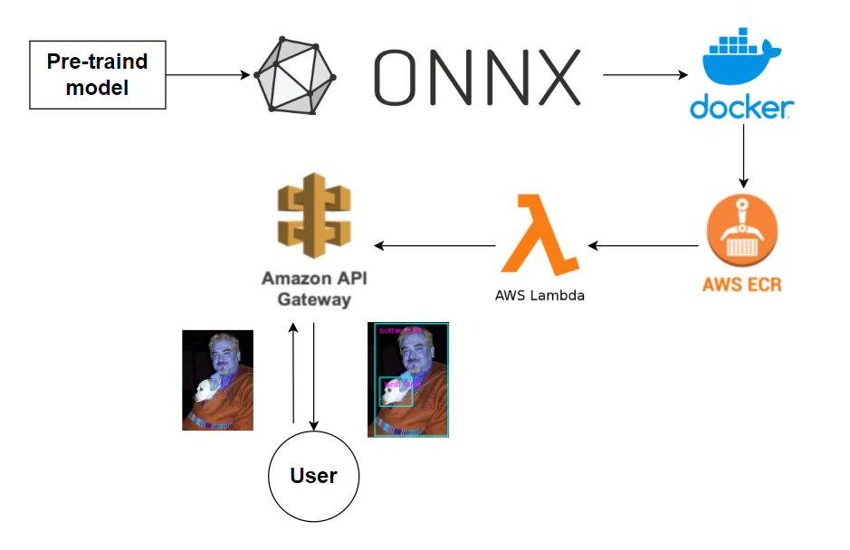

## Build a single shot detection server with AWS Lambda and API gateway.

This repository contains the code that inferences single shot detection with open source pre-trained model.

## Architecture


## Command

1. **Build a docker image**

```
docker build --build-arg AWS_ACCESS_KEY_ID=$AWS_ACCESS_KEY_ID --build-arg  AWS_SECRET_ACCESS_KEY=$AWS_SECRET_ACCESS_KEY  -t ssd_inference:test .
```

2. **Push to Elastic Contianer Registry**

```
docker tag ssd_inference:test <ECR URI>
docker push  <ECR URI>
```

3. **Build an API server with AWS Lambda and API Gateway**


## Reference

https://github.com/qfgaohao/pytorch-ssd
